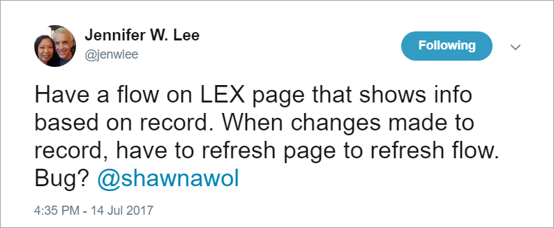
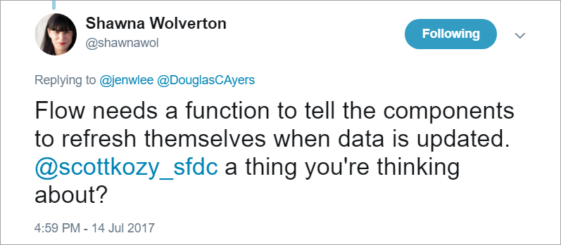
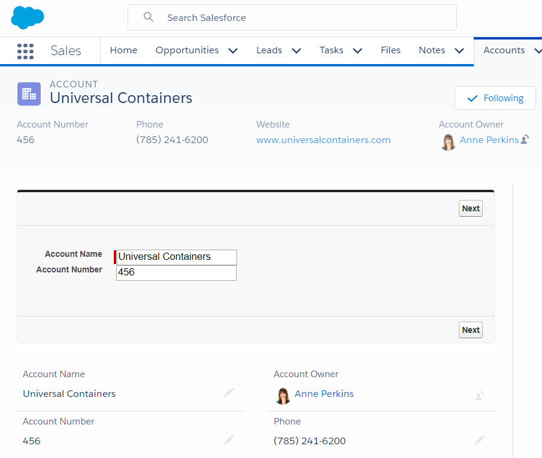
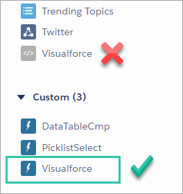
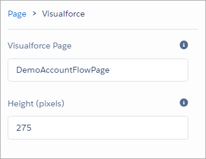
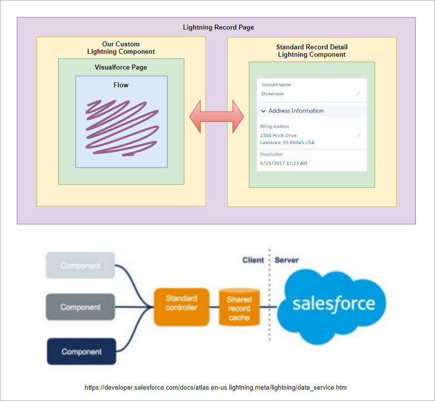

Reloadable Visualforce Lightning Component
==========================================

Overview
--------

This project is inspired by [Jennifer Lee](https://twitter.com/jenwlee) who [asked on Twitter](https://twitter.com/DouglasCAyers/status/886085746767126529)
how to have a Flow component in Lightning Record Page refresh and reflect changes when the record was updated.
This project is also inspired by [my growing interest](https://douglascayers.com/2017/06/24/dependent-page-layouts-dynamically-hideshow-form-fields-in-lightning-experience/) in embedding Flows in Lightning Pages.

To my knowledge, the standard Flow component provided by Salesforce does not (yet) provide this capability.
The Flow is static and doesn't react when the underlying record has changed.

The wonderful [Shawna Wolverton](https://twitter.com/shawnawol) replied saying that the Flow needed something to tell it to refresh.
In her reply she mentions [Scott Kozinchik](https://twitter.com/scottkozy_sfdc), Product Manager for Flow, and hints at future capabilities ^_^ #safeharbor

While we wait for Salesforce to roll this out as standard feature, this project demos embedding Flow (via Visualforce)
in Lightning Record Page and reloading the Flow when the record is updated.

This is achieved by the magic of [Lightning Data Service](https://developer.salesforce.com/docs/atlas.en-us.lightning.meta/lightning/data_service.htm)
which allows us to know when the record on the page has changed so that we can refresh the Visualforce page that embeds the Flow.
Likewise, if the Flow finishes then it may have created, updated, or deleted data too, so the Lightning Record Page is refreshed
in those scenarios. Bi-directional.

You can achieve the **exact same effect** without this project by manually refreshing your browser page after saving the record ;)
But who has time to do such trivial things like refreshing their browser page?!?!
["Not I", said the Cat.](https://en.wikipedia.org/wiki/The_Little_Red_Hen)
Yeah, me neither, so let's automate it!

Demo Video
----------

Installation
------------

You may install the unmanaged code from GitHub and make any desired adjustments.

* [Deploy from Github](https://githubsfdeploy.herokuapp.com)

This project includes the following:

* Flow (`Demo_Account_Flow`) - demo loading some account data
* Visualforce Page (`DemoAccountFlowPage`) - embeds the flow
* Lightning Component (`VisualforceRecordCmp`) - embeds the visualforce page, reloading it when the account record is updated
* Lightning Record Page (`Refresh_Flow_Account_Page`) - embeds the lightning component

Getting Started
---------------
1. Install this unmanaged package to your org using link above.
2. Edit (or create new) a **Lightning Record Page** for **Account** object (later you can repeat this for any other objects).
3. Ensure the **Standard** component named **Record Detail** is on your Lightning Page.
4. Drag the **Custom** component named **Visualforce** onto your Lightning Page.

5. Configure the **Custom** component by specifying **Visualforce Page** name (e.g. `DemoAccountFlowPage`).

6. **Save** and **Activate** your Lightning Record Page.
7. Navigate to an Account record page to test.
9. Edit and save the account record and notice your Flow refreshes too!
10. Click the Finish button on your Flow and notice the rest of the page refreshes too!

Customizations
--------------

The Lightning Component (`VisualforceRecordCmp`) is reusable. It really should be just drag-n-drop to your Lightning Record Pages
and you're off to the races! It prompts for two parameters: the name of a Visualforce Page to embed and the height in pixels.
Being as generic as it is, this simply lets you embed Visualforce Pages in your Lightning Record Pages **and be able to refresh**
automatically when the underlying record changes.

We build on top of that functionality to load a Visualforce Page that embeds a Flow, thereby being able to have our Flow
automatically refresh when the underlying record changes.

You do not have to use the included Flow (`Demo_Account_Flow`), it's just an example. You can come up with whatever Flow you want
provided that is has at least one **input text variable** to receive the record ID from the page.
Check out the `DemoAccountFlowPage` as example of how to embed your Flow in your page. 

Technical Architecture
----------------------

For those curious how this all works "under the hood", let's discuss the below diagram.

We have a Lightning Record Page with two Lightning Components side-by-side.
Within our custom component on the left is an embedded Visualforce Page which in-turn embeds a Flow.
The standard component on the right simply loads the record's layout and allows the user to edit the fields.

To communicate from the standard component to our custom component we do so indirectly.
With the **Lightning Data Service** our custom component subscribes to updates to the record then takes action.
This decouples the left and right components entirely, which is good because we can't do much with the standard component
to get it to talk to us anyways.

When our custom component receives event that the record has been updated then it simply reloads the iframe of the
Visualforce Page embedding our Flow. Our Flow runs again and re-queries fresh data. This is a good time to remind you
that Flows that are embedded on Visualforce Pages or Lightning Pages [should not perform any actions such as create
or delete records before the first screen](https://developer.salesforce.com/docs/atlas.en-us.salesforce_vpm_guide.meta/salesforce_vpm_guide/lightning_app_builder_customize_lex_pages_considerations_flow.htm). 

Ok, so that handles when the user updates the record using the standard component to cause our Flow to refresh.

What about the other way around, when our Flow **finishes** to cause the page to refresh?

When the user clicks the **Finish** button on your Flow you may have made some data changes, created, updated, or deleted records.
To ensure the whole page still displays current and relevant data then we should refresh those components too.

A couple challenges though, when the Flow finishes the only entity that knows is the Visualforce Page,
and the Visualforce Page embedded in an `iframe` on a different domain than the Lightning Components cannot simply
tell the `window` to refresh due to browser security. If the Visualforce Page were to attempt a `window.parent.reload();`
then it will be met with error `DOMException: Blocked a frame with origin "https://your-instance.visual.force.com" from accessing a cross-origin frame.`.

But fear not, [Christophe Coenraets](https://twitter.com/ccoenraets) has taught us [how to send messages from Visualforce Pages to Lightning Components](https://developer.salesforce.com/blogs/developer-relations/2017/01/lightning-visualforce-communication.html).
When our flow finishes then the Visualforce Page posts a message to its parent window, which is the Lightning Component.
The Lightning Component then tells the other components on the page they all [need to refresh](https://developer.salesforce.com/docs/atlas.en-us.lightning.meta/lightning/ref_force_refreshView.htm).
